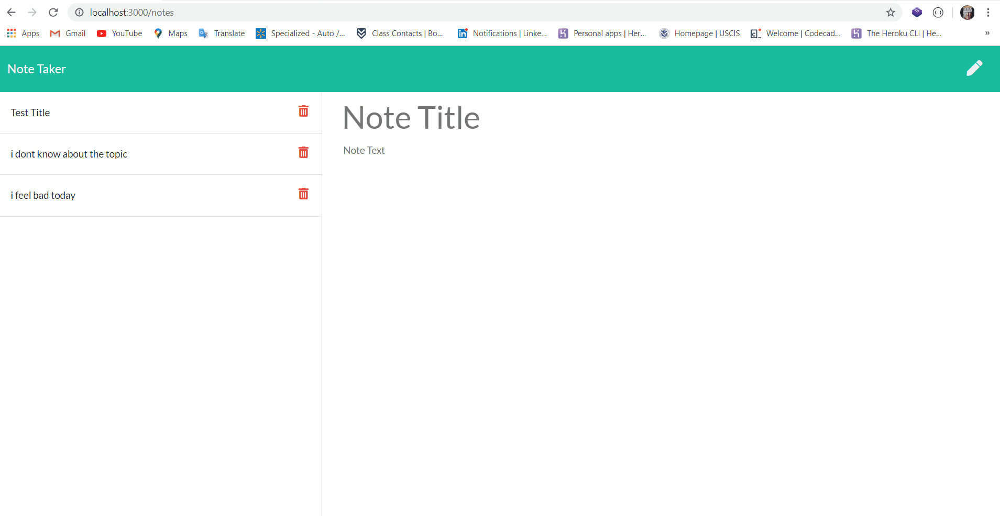

# The-NoteTaker

## Description
This is a note taker app that uses the Express to establish api routes and http requests. This application has a back end and a front end that is required to function properly. The server side listens for a request from the client and then responds accordingly whether a note is to be taken, saved or deleted. Express is hard on this project. This project is a full-stack work including front-end and back-end. I think I will use Express more often on combining front-end and back-end technologies.

## Contact:
Dominic Xu dominictxu1@gmail.com

## Link to deployed App
[Link to the GitHub page](https://lorddominic.github.io/The-NoteTaker)

## Gif
